<div align="center">

# 🏃‍♂️ FitFusion

### *Premium Flutter Fitness Tracking & Workout Planner Application*

[](https://flutter.dev/)
[](https://dart.dev/)
[](https://pub.dev/packages/flutter_animate)
[](https://pub.dev/packages/video_player)

FitFusion is a premium, feature-rich Flutter fitness application designed to manage workouts, track exercise progress, and execute personalized fitness plans. The platform features an elegant modern interface, interactive progress trackers, video demonstrations, and animated achievements.

[🌐 Flutter Documentation](https://docs.flutter.dev/) &nbsp;·&nbsp; [📁 Repository](https://github.com/AnasQ2003/Fitness-App)

</div>

---

## ✨ Features

- **📊 Comprehensive Workout Categories** — Browse popular exercises across structured disciplines including Cardio, Strength, Yoga, HIIT, Pilates, and Stretching.
- **⏱️ Active Workout Timer** — Real-time progress timing for exercises with step counts, circular animation progression rings, and play/pause controls.
- **🎥 Video Demonstrations** — Integrated video player (`video_player`) to watch high-definition video walkthroughs of exercises directly on the workout detail screen.
- **📈 Structured Workout Plans** — Ready-to-use beginner (4-week) and intermediate (6-week) multi-day fitness calendars.
- **➕ Custom Plan Creator** — Create and title custom workout plans and add personalized descriptions to adapt to your training goals.
- **👤 Profile Analytics & Badges** — Track overall achievements and core statistics (Workouts logged, active Hours, total Calories burned) alongside gamified badge indicators.
- **❤️ Favorites Drawer** — Quickly bookmark workouts using an animated favorite like button to display them in a dedicated favorites tab.
- **🔍 Fast Search** — Find specific workouts instantly using the built-in search view.
- **🌙 Premium UI Toggles** — Custom settings panels to easily configure notification triggers and toggle sound effects or dark/light modes.
- **⚡ Framer-like Animations** — Powered by `flutter_animate` to trigger elegant fade-ins, scales, and item-entrance visual adjustments.

---

## 🛠️ Tech Stack & Dependencies

### Core Frameworks
- **Flutter SDK (>=3.8.1)** — Cross-platform UI development kit.
- **Dart Language** — High-performance modern app codebase.

### Third-Party Libraries
- **`flutter_animate` (v4.1.1)** — Triggers premium entry effects, shakes, and visual cues.
- **`video_player` (v2.8.0)** — Handles high-performance native mp4 file streaming and playback.
- **`animated_text_kit` (v4.2.2)** — Animates title headers and typing effects in app bars.
- **`like_button` (v2.1.0)** — Renders interactive favorite toggles with bubble animation bursts.
- **`cupertino_icons` (v1.0.5)** — iOS style system vector resources.

---

## 📁 Project Structure

```
fitness_app/
│
├── assets/                         # Application resources
│   ├── images/
│   │   ├── workouts/               # Cardio, Strength, Yoga illustrations
│   │   ├── exercises/              # Jumping jacks, push-ups, squats thumbnails
│   │   └── misc/                   # Profile and general icons
│   └── *.mp4                       # HD exercise demonstration videos
│
├── lib/
│   └── main.dart                   # Single-entry app architecture (UI & routes)
│
├── test/                           # Widget and unit testing suite
├── pubspec.yaml                    # Dependency configuration manifest
├── analysis_options.yaml           # Lint formatting definitions
└── README.md
```

---

## 🚀 Getting Started

### Prerequisites
- **Flutter SDK** (v3.8.0 or higher)
- **Dart SDK** (v3.8.0 or higher)
- An **Android Emulator / iOS Simulator** or a physical test device

---

### Setup Instructions

1. **Clone the Repository:**
   ```bash
   git clone https://github.com/AnasQ2003/Fitness-App.git
   cd Fitness-App
   ```

2. **Install Flutter Dependencies:**
   ```bash
   flutter pub get
   ```

3. **Verify Connected Devices:**
   ```bash
   flutter devices
   ```

4. **Run the Application:**
   ```bash
   flutter run
   ```

---

## 📷 Screenshots Gallery

A visual walkthrough of the FitFusion interface showcasing its main sections, detailed workout screens, video players, and user profile configuration.

### 📱 1. Explore Workouts & Categories

The home dashboard is the central hub where users can filter exercises by categories or select popular ready-to-run workouts.

<table>
  <tr>
    <td>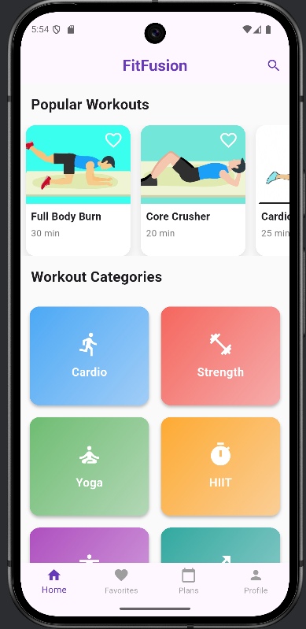<br/><sub>Home Dashboard & Categories</sub></td>
    <td>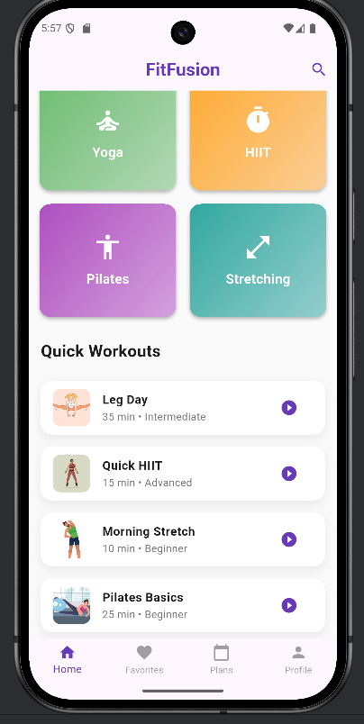<br/><sub>Quick Workouts List</sub></td>
    <td>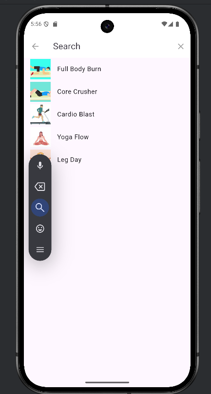<br/><sub>Search & Find Workouts</sub></td>
  </tr>
</table>

### 🏋️‍♂️ 2. Workout Details & Exercises

Tapping any workout loads its detail sheet, displaying difficulty metrics, calories, custom exercises, and instructional steps.

<table>
  <tr>
    <td>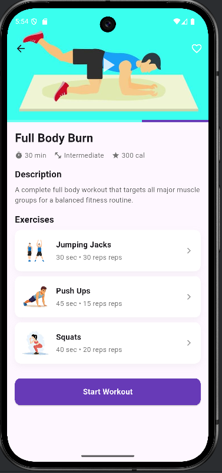<br/><sub>Workout Details & Video Player</sub></td>
    <td>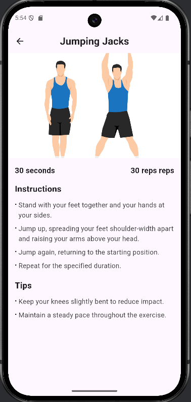<br/><sub>Exercise Instructions — Jumping Jacks</sub></td>
    <td>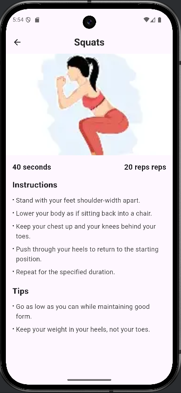<br/><sub>Exercise Instructions — Squats</sub></td>
  </tr>
</table>

### ⏱️ 3. Active Workout Timer

A dedicated timer screen guides users through their routine, tracking progress counts and timer durations dynamically.

<table>
  <tr>
    <td align="center">
      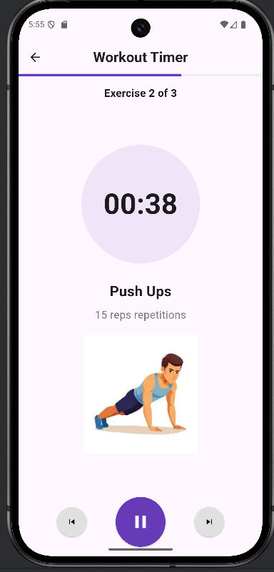<br/><sub>Interactive Active Workout Timer</sub>
    </td>
  </tr>
</table>

### 📅 4. Workout Plans & Favorites

Organize workouts by following structured beginner or intermediate programs, or save favorites to view them instantly.

<table>
  <tr>
    <td>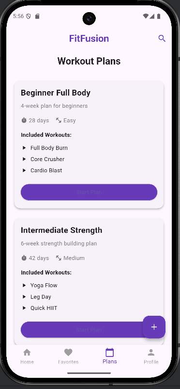<br/><sub>Workout Plans & Programs</sub></td>
    <td>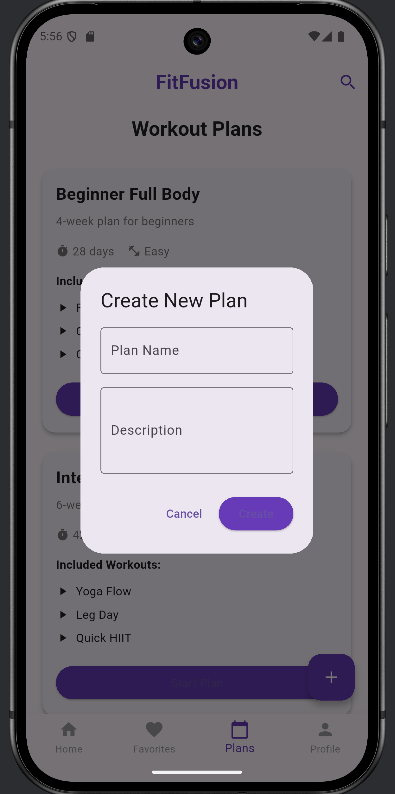<br/><sub>Create Custom Plan Dialog</sub></td>
    <td>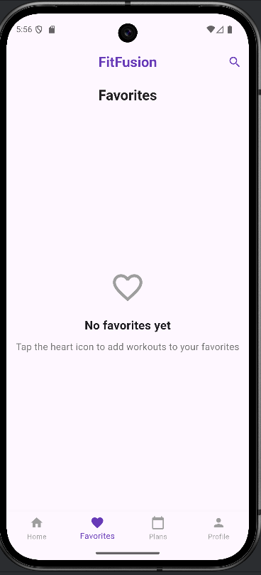<br/><sub>Favorites Drawer (Empty State)</sub></td>
  </tr>
</table>

### 👤 5. Profile Analytics & Settings

Track overall fitness progress with metrics charts, unlock achievements, and toggle settings like dark mode themes.

<table>
  <tr>
    <td>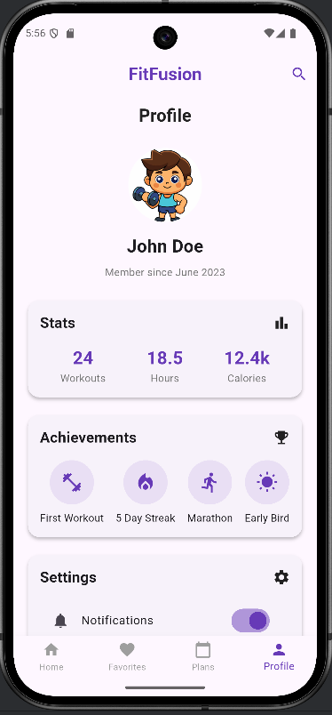<br/><sub>User Profile Stats & Achievements</sub></td>
    <td>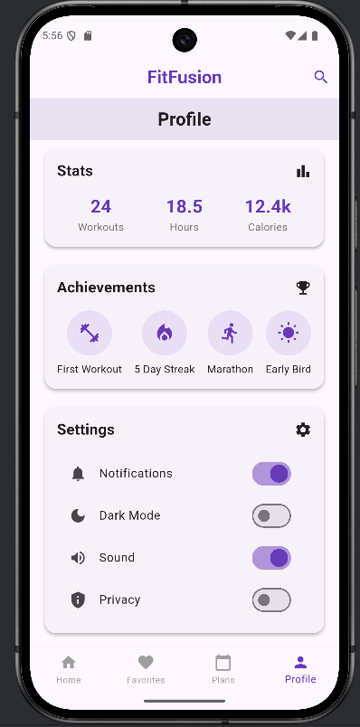<br/><sub>Profile Settings & Options</sub></td>
  </tr>
</table>

---

## 📜 License

© 2026 **Anas Ahmed**. All Rights Reserved.

---

<div align="center">

Built with ❤️ using **Flutter & Dart**

⭐ If you found this app helpful, please give the repository a star!

</div>
